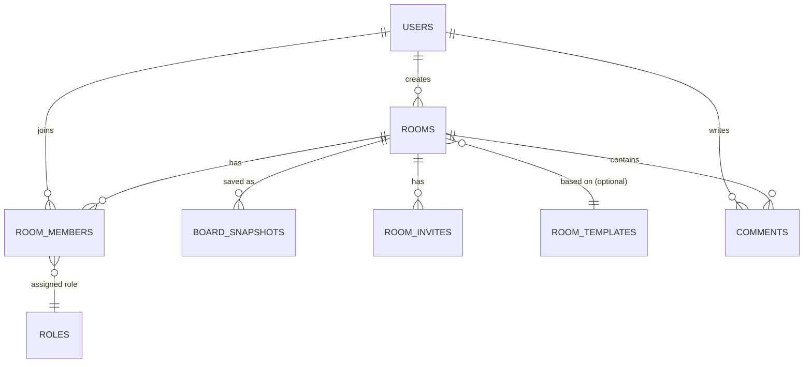

# ERD & Arsitektur WebSocket Server
## Real-time Collaborative Whiteboard — Dokumen Pendamping PRD

**Versi:** 1.0
**Tanggal:** 27 September 2026

---

# BAGIAN A — ERD & Skema Data

Sistem ini punya **dua jenis data** yang perlu dipisah pemahamannya:
1. **Data permanen** (disimpan di PostgreSQL) — user, room, permission, metadata board
2. **Data board real-time** (disimpan sebagai Yjs CRDT document, bukan tabel relasional biasa) — shape, posisi objek, dll

Ini penting dipahami dari awal karena kesalahan umum adalah mencoba menyimpan tiap shape sebagai row di database relasional dan sync manual — itu justru bikin sistem lambat dan konfliknya susah dihandle. Objek board hidup di **Y.Doc** (in-memory + periodic snapshot), sementara PostgreSQL hanya menyimpan **metadata & snapshot binary**-nya.

---

## A.1 Diagram Relasi (Data Permanen — PostgreSQL)



---

## A.2 Definisi Tabel (PostgreSQL — Data Permanen)

### `users`
| Kolom | Tipe | Keterangan |
|---|---|---|
| id | UUID (PK) | |
| email | VARCHAR(255) UNIQUE | nullable jika guest |
| display_name | VARCHAR(100) | |
| avatar_color | VARCHAR(7) | hex color, dipakai untuk kursor & avatar unik |
| password_hash | VARCHAR(255) (nullable) | null jika guest/OAuth |
| auth_provider | ENUM | `email`, `google`, `guest` |
| is_guest | BOOLEAN DEFAULT false | |
| created_at | TIMESTAMP | |

### `rooms`
| Kolom | Tipe | Keterangan |
|---|---|---|
| id | UUID (PK) | dipakai juga sebagai room identifier di WebSocket |
| name | VARCHAR(255) | |
| owner_id | UUID (FK → users.id) | |
| template_id | UUID (FK → room_templates.id, nullable) | jika dibuat dari template |
| access_type | ENUM | `private` (invite only), `link` (siapapun dengan link), `public` |
| is_archived | BOOLEAN DEFAULT false | |
| last_activity_at | TIMESTAMP | untuk auto-cleanup room tidak aktif |
| created_at | TIMESTAMP | |

### `room_members`
| Kolom | Tipe | Keterangan |
|---|---|---|
| id | UUID (PK) | |
| room_id | UUID (FK → rooms.id) | |
| user_id | UUID (FK → users.id, nullable) | null jika guest tanpa akun |
| guest_session_id | VARCHAR(100) (nullable) | identifier sementara untuk guest |
| role | ENUM | `owner`, `editor`, `viewer` |
| joined_at | TIMESTAMP | |
| last_seen_at | TIMESTAMP | untuk presence history |
| UNIQUE | (room_id, user_id) | |

### `room_invites`
| Kolom | Tipe | Keterangan |
|---|---|---|
| id | UUID (PK) | |
| room_id | UUID (FK → rooms.id) | |
| invite_token | VARCHAR(100) UNIQUE | dipakai di URL join |
| role_granted | ENUM | `editor`, `viewer` |
| expires_at | TIMESTAMP (nullable) | |
| max_uses | INT (nullable) | null = unlimited |
| used_count | INT DEFAULT 0 | |
| created_by | UUID (FK → users.id) | |

### `board_snapshots`
Ini tabel paling penting secara arsitektur — menyimpan **binary state Yjs document** secara periodik, bukan menyimpan tiap objek sebagai row.
| Kolom | Tipe | Keterangan |
|---|---|---|
| id | UUID (PK) | |
| room_id | UUID (FK → rooms.id) | |
| snapshot_data | BYTEA | binary encoded Yjs document (`Y.encodeStateAsUpdate(doc)`) |
| version_number | INT | auto-increment per room, untuk version history |
| snapshot_type | ENUM | `auto` (periodic), `manual` (user save eksplisit) |
| created_by | UUID (FK → users.id, nullable) | null jika auto-save sistem |
| created_at | TIMESTAMP | |
| INDEX | (room_id, version_number DESC) | untuk ambil snapshot terbaru dengan cepat |

### `room_templates`
| Kolom | Tipe | Keterangan |
|---|---|---|
| id | UUID (PK) | |
| name | VARCHAR(100) | "Kanban Board", "Mind Map", "Retrospective" |
| thumbnail_url | VARCHAR(500) | |
| initial_snapshot_data | BYTEA | Y.Doc awal berisi struktur template |

### `comments`
| Kolom | Tipe | Keterangan |
|---|---|---|
| id | UUID (PK) | |
| room_id | UUID (FK → rooms.id) | |
| object_id | VARCHAR(100) (nullable) | ID objek di Y.Doc yang di-comment (referensi non-FK, karena objek hidup di Yjs bukan Postgres) |
| user_id | UUID (FK → users.id) | |
| content | TEXT | |
| position_x | FLOAT (nullable) | posisi pin komentar di kanvas |
| position_y | FLOAT (nullable) | |
| resolved | BOOLEAN DEFAULT false | |
| created_at | TIMESTAMP | |

---

## A.3 Struktur Data Board (Y.Doc — Bukan Tabel SQL)

Ini bukan skema database biasa, tapi struktur *shared document* yang disinkronkan real-time antar client via Yjs. Perlu didokumentasikan terpisah karena inilah "jantung" aplikasi.

```typescript
// Root Y.Doc per room, terdiri dari beberapa shared type:

const yDoc = new Y.Doc();

// 1. Semua objek kanvas (shape, teks, freehand)
const yObjects = yDoc.getMap('objects');
// key: object.id (string UUID)
// value: Y.Map berisi properti objek (lihat struktur di PRD Section 5.4)

// 2. Urutan z-index / layering (array terpisah biar gampang reorder tanpa konflik field individual)
const yLayerOrder = yDoc.getArray('layerOrder');
// isi: array of object.id, urutan menentukan tampilan depan-belakang

// 3. Grouping info
const yGroups = yDoc.getMap('groups');
// key: group.id, value: Y.Array berisi object.id yang jadi anggota grup

// 4. Metadata board (nama, background color, dll — jarang berubah tapi tetap perlu sync)
const yMeta = yDoc.getMap('meta');
```

**Awareness state (terpisah dari Y.Doc, tidak persisten):**
```typescript
// Data sementara: kursor, selection, siapa sedang online
awareness.setLocalState({
  user: { name, color, id },
  cursor: { x, y },
  selectedObjectIds: string[],   // supaya user lain tahu objek mana yang lagi di-drag siapa
});
```

**Kenapa dipisah jadi beberapa Y.Map/Y.Array (bukan satu Y.Map raksasa)?**
Supaya granularitas sinkronisasi lebih halus — update pada satu shape tidak perlu re-encode seluruh struktur objek lain, mengurangi payload data yang dikirim tiap perubahan kecil.

---

# BAGIAN B — Arsitektur WebSocket Server

## B.1 Komponen Utama

```
┌─────────────┐     WebSocket      ┌──────────────────┐
│  Client A   │ ◄────────────────► │                    │
└─────────────┘                    │                    │
┌─────────────┐     WebSocket      │  WebSocket Server  │
│  Client B   │ ◄────────────────► │  (Node.js +        │
└─────────────┘                    │   y-websocket)     │
┌─────────────┐     WebSocket      │                    │
│  Client C   │ ◄────────────────► │                    │
└─────────────┘                    └─────────┬──────────┘
                                              │
                              ┌───────────────┴───────────────┐
                              │                                │
                     ┌────────▼────────┐            ┌──────────▼─────────┐
                     │  Redis Pub/Sub    │            │   PostgreSQL        │
                     │  (multi-server     │            │   (snapshot +       │
                     │   broadcast)       │            │    metadata)        │
                     └────────────────────┘            └─────────────────────┘
```

## B.2 Alur Koneksi & Room Management

```typescript
// Server-side (Node.js + ws + y-websocket utils)

wss.on('connection', (conn, req) => {
  const roomId = extractRoomIdFromUrl(req.url);  // ws://server/room/{roomId}
  const userId = authenticateFromToken(req);      // verifikasi JWT atau guest token

  // 1. Cek permission user ke room ini (query ke Postgres: room_members)
  const permission = await checkRoomPermission(roomId, userId);
  if (!permission) return conn.close(4001, 'Unauthorized');

  // 2. Ambil atau buat instance Y.Doc untuk room ini (in-memory map di server)
  const docInstance = getOrCreateDoc(roomId);

  // 3. Kalau room baru pertama kali di-load, restore dari snapshot terakhir di DB
  if (docInstance.isNew) {
    const latestSnapshot = await getLatestSnapshot(roomId);
    if (latestSnapshot) Y.applyUpdate(docInstance.doc, latestSnapshot.snapshot_data);
  }

  // 4. Bind koneksi WebSocket ini ke Y.Doc (y-websocket handle sinkronisasi otomatis)
  setupWSConnection(conn, req, { docName: roomId, gc: true });

  // 5. Track presence untuk analytics/last_seen
  updateRoomMemberLastSeen(roomId, userId);
});
```

## B.3 Multi-Server Scaling (Redis Pub/Sub)

Masalah: kalau ada 2+ instance server (untuk load balancing), user A yang connect ke Server 1 dan user B yang connect ke Server 2 di room yang sama **tidak akan saling menerima update** kalau Y.Doc hanya disimpan in-memory per server.

**Solusi:** gunakan Redis sebagai message broker — setiap update Y.Doc di satu server di-publish ke Redis channel, semua server subscribe dan apply update yang diterima ke instance Y.Doc lokal mereka.

```typescript
// Saat server menerima update dari client lokal
ydoc.on('update', (update, origin) => {
  // Broadcast ke client lain yang connect ke server INI (langsung, tanpa Redis)
  broadcastToLocalClients(roomId, update, origin);

  // Broadcast ke server LAIN via Redis (supaya client di server lain juga dapat)
  redisPublisher.publish(`room:${roomId}`, update);
});

// Saat server menerima broadcast dari Redis (berasal dari server lain)
redisSubscriber.subscribe(`room:${roomId}`, (update) => {
  Y.applyUpdate(ydoc, update, 'redis-origin');  // origin ditandai supaya tidak infinite loop broadcast
  broadcastToLocalClients(roomId, update, 'redis-origin');
});
```

> **Catatan implementasi:** Untuk MVP portfolio, 1 server WebSocket saja sudah cukup untuk demo — bagian Redis pub/sub ini didokumentasikan sebagai **rencana scaling**, bukan wajib diimplementasikan di awal. Tapi sangat worth dijelaskan saat interview sebagai bukti kamu paham keterbatasan arsitektur single-server.

## B.4 Auto-Save / Persistence Strategy

Y.Doc di memory server bisa hilang kalau server restart, jadi perlu strategi snapshot berkala:

```typescript
// Debounced auto-save: tunggu 5 detik tanpa aktivitas baru sebelum save
const debouncedSave = debounce(async (roomId, ydoc) => {
  const update = Y.encodeStateAsUpdate(ydoc);
  await db.query(
    `INSERT INTO board_snapshots (room_id, snapshot_data, version_number, snapshot_type)
     VALUES ($1, $2, (SELECT COALESCE(MAX(version_number), 0) + 1 FROM board_snapshots WHERE room_id = $1), 'auto')`,
    [roomId, update]
  );
}, 5000);

ydoc.on('update', () => debouncedSave(roomId, ydoc));

// Tambahan: interval save maksimal, walau masih terus ada aktivitas
setInterval(() => forceSave(roomId, ydoc), 60_000); // paksa save tiap 1 menit
```

## B.5 Room Cleanup (Memory Management)

Karena setiap room aktif menyimpan Y.Doc di memory server, room yang sudah tidak ada koneksi aktif harus dibersihkan supaya tidak memory leak:

```typescript
function onLastClientDisconnect(roomId: string) {
  // Tunggu grace period (misal 2 menit) sebelum benar-benar unload dari memory
  // (menghindari unload-reload berulang kalau user sekadar refresh halaman)
  setTimeout(async () => {
    if (getActiveConnectionCount(roomId) === 0) {
      await forceSave(roomId, getDoc(roomId));  // pastikan tersimpan dulu
      removeDocFromMemory(roomId);
    }
  }, 120_000);
}
```

## B.6 Autentikasi WebSocket

WebSocket handshake tidak native support header Authorization seperti REST API, jadi token biasanya dikirim via query param atau subprotocol saat koneksi awal:

```typescript
// Client
const ws = new WebSocket(`wss://server.com/room/${roomId}?token=${jwtToken}`);

// Server: verifikasi token SEBELUM upgrade ke WebSocket, bukan setelahnya
server.on('upgrade', async (req, socket, head) => {
  const token = new URL(req.url, 'http://x').searchParams.get('token');
  const isValid = await verifyJWT(token);
  if (!isValid) {
    socket.write('HTTP/1.1 401 Unauthorized\r\n\r\n');
    socket.destroy();
    return;
  }
  wss.handleUpgrade(req, socket, head, (ws) => wss.emit('connection', ws, req));
});
```

---

## B.7 Ringkasan Keputusan Arsitektur (untuk dijelaskan saat interview)

| Keputusan | Alasan |
|---|---|
| Y.Doc di memory server, bukan langsung ke Postgres tiap perubahan | Postgres tidak dirancang untuk write frequency setinggi tiap gerakan mouse; Yjs sudah efisien secara in-memory |
| Snapshot binary, bukan menyimpan tiap objek sebagai row relasional | Objek board terlalu dinamis (shape, posisi, nested group) untuk dinormalisasi jadi tabel relasional secara efisien; CRDT sudah punya format serialisasi sendiri |
| Redis pub/sub untuk multi-server (opsional) | Menghindari single point of failure & memungkinkan horizontal scaling |
| Awareness state terpisah dari Y.Doc | Data kursor/presence berubah puluhan kali per detik dan tidak perlu persisten — memisahkannya mencegah snapshot board membengkak percuma |
| Auth di-handle sebelum WebSocket upgrade | Mencegah koneksi tidak sah membebani server sebelum divalidasi |

---

## Lampiran: Dependency Utama

| Library | Fungsi |
|---|---|
| `yjs` | Core CRDT engine |
| `y-websocket` | Provider WebSocket resmi untuk Yjs (client & server utils) |
| `y-protocols` (awareness) | Protokol presence/cursor sharing |
| `konva` + `react-konva` | Rendering kanvas berbasis React |
| `ioredis` | Redis client untuk pub/sub multi-server |
| `ws` | WebSocket server library dasar di Node.js |
